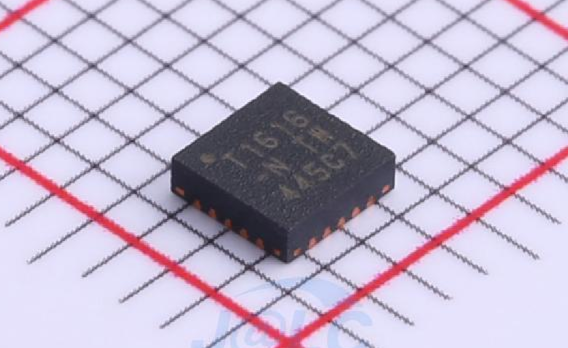
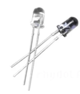
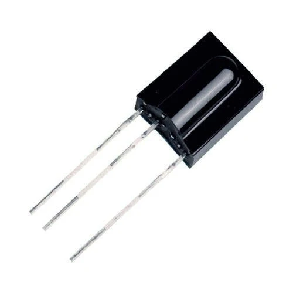
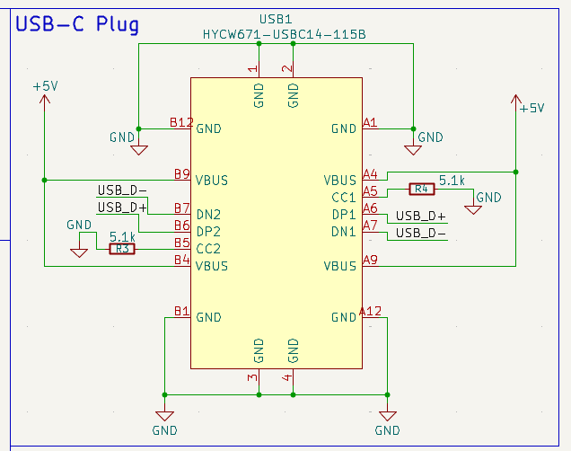

# **Cmote**

A USB-C IR transmitter for controlling devices like ACs, TVs for when you're too lazy to find the remote and your smartphone does not have a built-in IR blaster. Built-in to a devboard powered by the Attiny1616 MCU.

Time Spent: `13h`

---
---
### `(#01)` 26/08/26 (22:39)
## Beginning: 1h

This is the start of Cmote!<br>
I researched about the components that will be required to make this and added them to my schematics in KiCAD.<br>
The PCB files are available in the [PCB directory](./PCB/).

I settled upon using the ATtiny1616 microcontroller as it is small, capable enough, has hardware timers and consumes very less power while working directly with 5V logic level.



<br>

For transmitting the IR signals, I settled upon using this `Infrared LED Emitter` I found on JLC which will be soldered to the PCB directly and is a small 0402 package: [link](https://jlcpcb.com/partdetail/EverlightElec-IR16_213C_L510TR8/C2943465). It supports 5V at 940nm wavelength which is extremely common in IR devices.



I will be using this with a Si2302 mosfet to properly drive it as driving it directly from the MCU is never a good idea.
<br>

For receiving the IR signals I settled upon using `TSOP 1738` as it consists of a PIN diode and a preamplifier which are embedded into a single package ([source](https://robocraze.com/products/tsop-1738?_pos=6&_sid=ae6cf2b3a&_ss=r#:~:text=The%20TSOP1738%20IR%20sensor%20module%20consists%20of%20a%20PIN%20diode%20and%20a%20preamplifier%20which%20are%20embedded%20into%20a%20single%20package.)).




<br>

Other than that, I setup this GitHub repository with the `README.md` and `JOURNAL.md` files with a clean directory structure for easier management of this project.

---
---
### `(#02)` 27/08/26 (02:03)
## Schematics, BOM: 3h

I connected all the components together by looking at their individual datahsheets and keeping in mind the voltage levels and tolerances along with stuff like bypass, decoupling capacitors that were mentioned in the datasheets.

For the Attiny1616, I added a CH340N to convert serial to USB signals which will allow us to communicate with our device over a USB port.

I haven't added the USB plug yet, that is for the next journal.

I added 2.54mm header pads for the following:
- Power (+5V, GND)
- UPDI Programming (VDD, GND, UPDI)
- 2x 8pin unused MCU Pins (7 pins, 1 GND)


---
---
### `(#03)` 27/08/26 (05:39)
## USB-C, PCB: 5h

I completed the schematics including the USB-C Plug



I used [this](https://www.lcsc.com/product-detail/C53436568.html) USB-C plug from JLCPCB, and it extremely hard to find a side-mount USB-C plug that supported economic assembly (standard assembly costs too much)

I finished routing the PCB and made sure the decoupling capacitors were as close to the appropriate pin as possible and routed the USB D+ and D- as differential pairs to ensure signal integrity.

The PCB is a 4-layer stackup:
- Layer 1: Top F.Cu (signal traces)
- Layer 2: In1.Cu (ground plane)
- Layer 3: In2.Cu (power plane)
- Layer 4: Bottom B.Cu (signal traces)

The finished routed PCB looks like this:


Preview PCB 3D View:


Note that this board has no "reset button" as it will be programmed using the UPDI header pad (extreme bottom right) which does not require a reset button. As for programming the board, it requires a specialized UPDI programmer BUT i will be using another devboard to program this using [pyupdi](https://github.com/mraardvark/pyupdi/).

---
---
### `(#04)` 28/08/26 (03:03)
## CAD: 4h

While this is technically a devboard and has no requirement for a case, I still made one using Fusion360.

It looks like this:


The lid will friction fit into the case using the side extrusions.

It has rectangular cuts for headers so the devboard can be freely used without taking off the lid again and again.

---
---
### `(#05)` 28/08/26 (04:15)
## Firmware: 1h

I implemented basic firmware for sending a power command using the IR led and also receiving IR data from the TSOP 1738.

I used VSCode with the PlatformIO extension to speed up the dev process and ensured that the project built successfully. Now the only thing remaining is testing whether it actually works in real life and then I can move on the completing the actual firmware.

The current firmware (located in [/firmware/cmote/](./firmware/cmote/)) is this:

```cpp
bool sentPwrCmd = false;

void setup() {
	Serial.begin(115200); // serial is on usb-c
	IrSender.begin(IR_TX_PIN);
	IrReceiver.begin(IR_RX_PIN, ENABLE_LED_FEEDBACK); 
}

void loop() {

	if (!sentPwrCmd) {
		uint16_t address = 0x00; // standard device address
		uint8_t command = 0x45;  // standard power command
		IrSender.sendNEC(address, command, 0);
		sentPwrCmd = true;
		Serial.println("=== power command was sent!! ===");
	}

	if (IrReceiver.decode()) {
		Serial.println("-------------------------");
		Serial.println("\tbegin decode():");
        Serial.print("Protocol: ");
        Serial.println(getProtocolString(IrReceiver.decodedIRData.protocol));
        Serial.print("Command (Hex): 0x");
        Serial.println(IrReceiver.decodedIRData.command, HEX);
        Serial.print("Address (Hex): 0x");
        Serial.println(IrReceiver.decodedIRData.address, HEX);
        Serial.println("-------------------------\n");
        IrReceiver.resume(); 
    }

}
```

It will send a power command at the start and then just listen to all the IR signals and print them to the serial on USB-C port of the board.