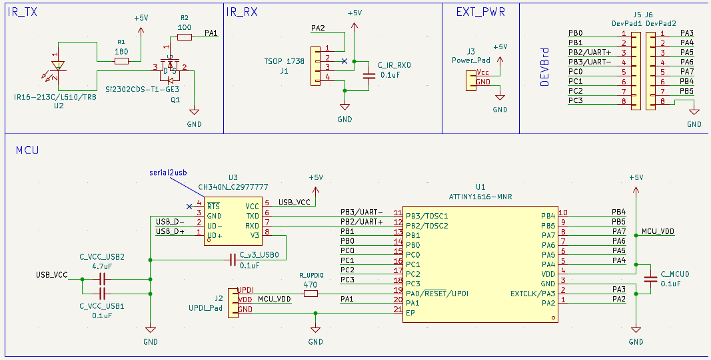
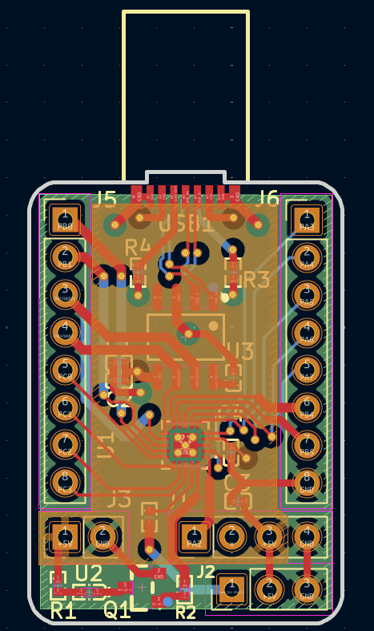
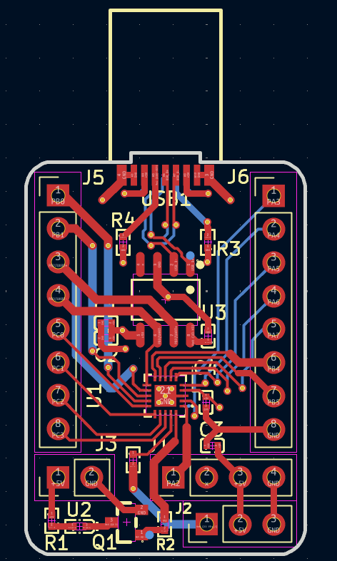
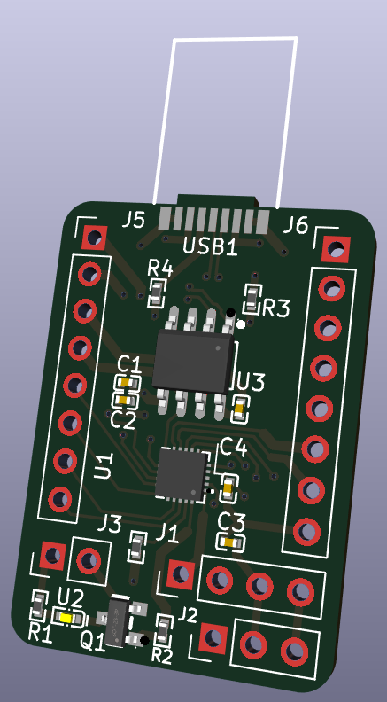
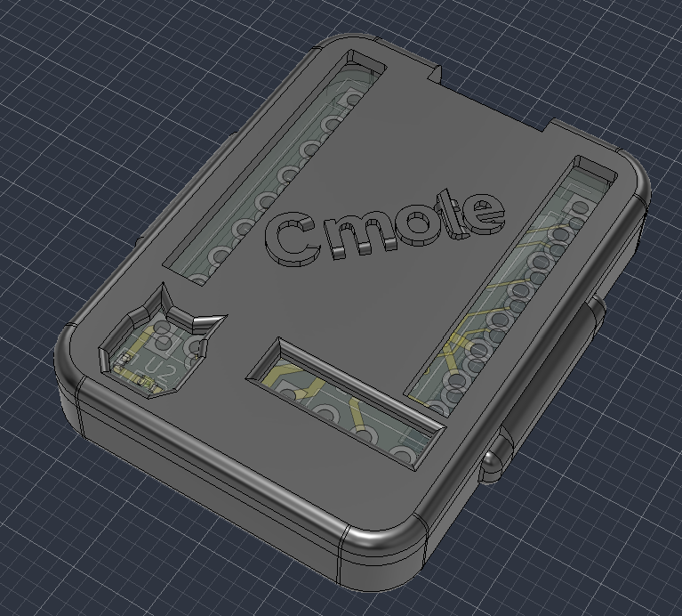
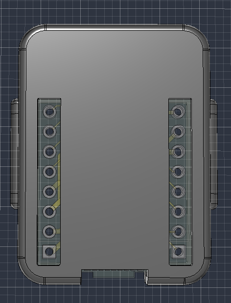
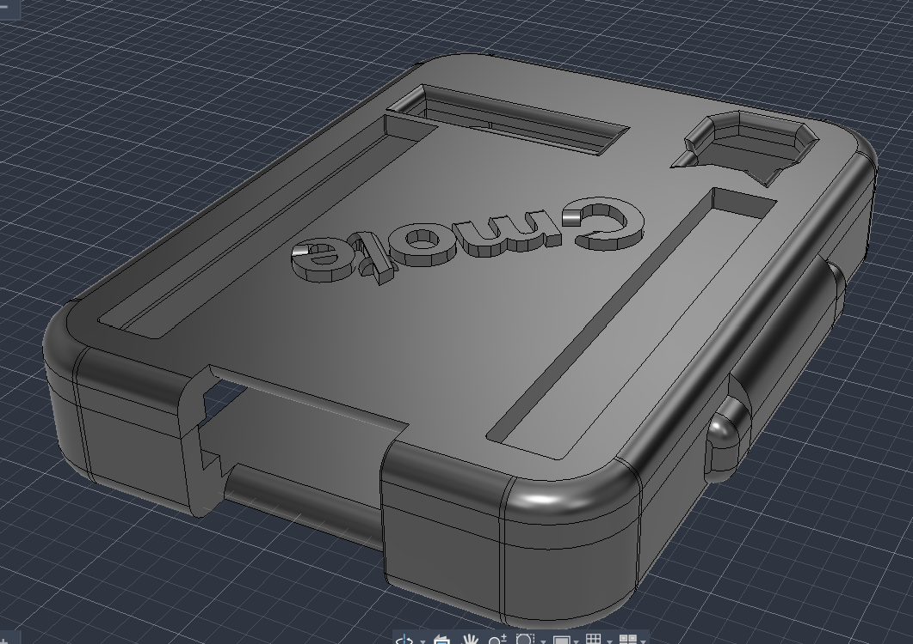
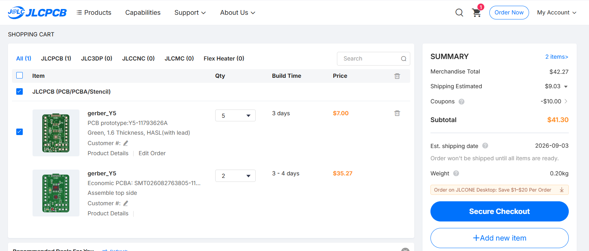
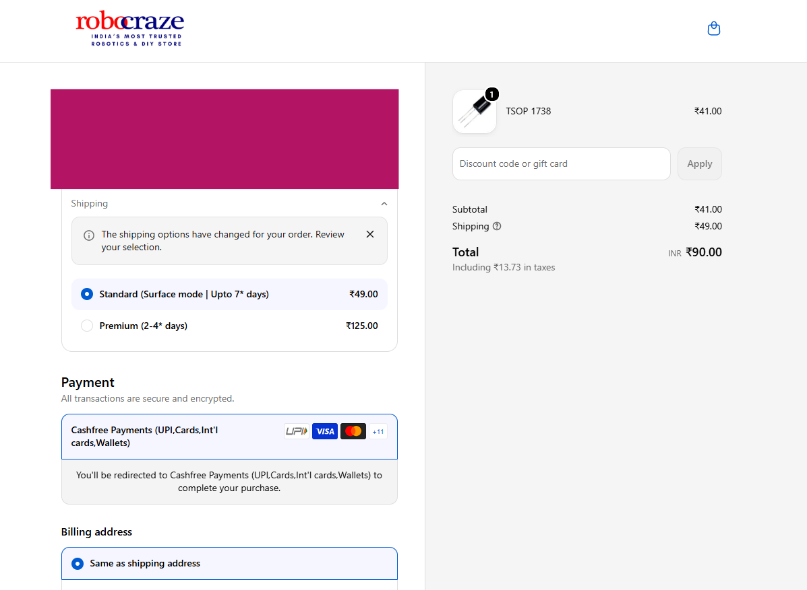

# **Cmote**

A USB-C IR transmitter for controlling devices like ACs, TVs for when you're too lazy to find the remote and your smartphone does not have a built-in IR blaster. Built-in to a devboard powered by the Attiny1616 MCU.

# PCB
> View PCB Directory: [/PCB](./PCB)

Schematics:



PCB:




Preview PCB 3D View:



Steps to open the schematics and PCB files in KiCAD:
- Open KiCAD
- Click **File** (top left) >> **Open Project**
- Navigate to this repository's saved destination,
- Open **/PCB/Cmote** directory
- Select the file `Cmote.kicad_pro`

This will open the schematics and PCB in KiCAD for easier viewing!

# Firmware
> View firmware directory: [/firmware](./firmware/)

> Note that firmware is Work In Progress. Until I physically receive the board I have no way of knowing whether this works or not so current it is just basic stuff.

The current firmware will send a power command at the start, listen to all the IR signals and print them to the serial on USB-C port of the board:

```cpp
bool sentPwrCmd = false;

void setup() {
	Serial.begin(115200); // serial is on usb-c
	IrSender.begin(IR_TX_PIN);
	IrReceiver.begin(IR_RX_PIN, ENABLE_LED_FEEDBACK); 
}

void loop() {

	if (!sentPwrCmd) {
		uint16_t address = 0x00; // standard device address
		uint8_t command = 0x45;  // standard power command
		IrSender.sendNEC(address, command, 0);
		sentPwrCmd = true;
		Serial.println("=== power command was sent!! ===");
	}

	if (IrReceiver.decode()) {
		Serial.println("-------------------------");
		Serial.println("\tbegin decode():");
        Serial.print("Protocol: ");
        Serial.println(getProtocolString(IrReceiver.decodedIRData.protocol));
        Serial.print("Command (Hex): 0x");
        Serial.println(IrReceiver.decodedIRData.command, HEX);
        Serial.print("Address (Hex): 0x");
        Serial.println(IrReceiver.decodedIRData.address, HEX);
        Serial.println("-------------------------\n");
        IrReceiver.resume(); 
    }

}
```

**IrReceiver and IrSender is from the [IRremote](https://registry.platformio.org/libraries/z3t0/IRremote) library.**

As for flashing the firmware onto the board, it requires a specialized UPDI programmer. However, I will be using another devboard to program this using **[pyupdi](https://github.com/mraardvark/pyupdi/)**. This guide will be updated after I test it myself to confirm what works and what does not.


# CAD
> View CAD Directory: [/CAD](./CAD)

While this is technically a devboard and has no requirement for a case, I still made one using Fusion360.

It looks like this:

> USB-C plug is invisible as no model was available for it from the manufacturer so I made sure to give enough space by measuring the silkscreen dimensions on the PCB and using it as the reference.





The lid will friction fit into the case using the side extrusions.

It has rectangular cuts for headers so the devboard can be freely used without taking off the lid again and again.

**For 3d printing, files [Cmote_body.step](./CAD/Cmote_body.step) and [Cmote_lid.step](./CAD/Cmote_lid.step) need to be printed as different bodies.**

## Ordering Parts

I will be using JLCPCB to order my PCB as for my location it is the cheapest option (if using PCB Assembly service).

Please checkout the [JLC_Order](./PCB/JLC_Order/) directory for bom, cpl and gerber files.

The grand total for this project comes out to be at `42.24 USD`

- This is when I have used basic parts when possible and only 2 PCBA with 5 PCB (moq)

[View BOM](./bom.csv) <br>
[View PCBA BOM](./PCB/JLC_Order/pcb_bom.csv) <br>


